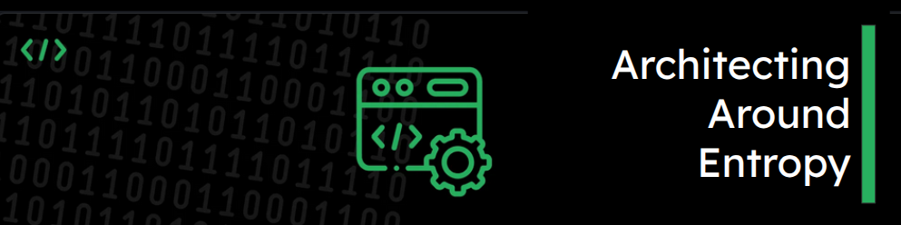

# Hello World! I am Anuj Sadani 👋

I believe in **People >= Process >= Technology**. If there is an off-balance between them, then I trust on **"Kamehameha"**



<br>

```python
class AboutMe():
  def __init__(self):
    self.name = "Anuj Sadani"
    self.username = "asadani"
    self.location = "Pune, India"
    self.linkedin = "https://www.linkedin.com/in/anujsadani"
    self.current_org = "https://www.infrrd.ai/"
    self.pronouns = ["He", "Him", "His"]
  
  def __str__(self):
    return self.name

if __name__ == '__main__':
    me = AboutMe()
    print(me.__dict__)
```

<hr>

## Technologies & Tools

### Generative AI & LLMs

<p>
<div style="word-spacing: 15px">
    
    
    
    
    
    
    
</div>
</p>

### Cloud, Architecture & Backend

<p>
<div style="word-spacing: 15px">
    
    
    
    
    
    
    
    
    
    
    
    
    
    
</div>
</p>

### DevOps & Observability

<p>
<div style="word-spacing: 15px">
    
    
    
    
    
    
    
    
    
    
    
    
    
</div>
</p>

### Leadership & Strategy

<p>
<div style="word-spacing: 15px">
    
    
    
    
    
    
    
</div>
</p>

<hr>

### Current Focus & Aspirations

- ✍️ Write technical/professional blogs on GenAI, RAG systems, and architecture patterns
- 📦 Publish open-source Python packages for AI/ML workflows
- 🎓 Complete advanced certifications in cloud architecture and AI/ML
- 🚀 Contribute to open-source AI/ML projects and frameworks

<hr>

### Interests & Passions

|                               Programming Philosophy                               |                        Technology Trends                        |                      Product Strategy & Design Thinking                      |                        Exploring Distant Lands                        |                           Socializing                           |
| :--------------------------------------------------------------------------------: | :--------------------------------------------------------------: | :---------------------------------------------------------------------------: | :-------------------------------------------------------------------: | :-------------------------------------------------------------: |
| Clean code principles<br />System design patterns<br />Architecture best practices | GenAI & LLMs<br />Cloud-native solutions<br />MLOps & automation | Product roadmap alignment<br />Design thinking<br />Stakeholder collaboration | Travel & exploration<br />Cultural experiences<br />Chilling with family | Team building<br />Knowledge sharing <br />Community engagement |

<hr>

### Fun Facts & Quotes

> "When I wrote the code, only God and I knew how it worked. Now God alone knows!" — *The eternal truth of legacy code*
>
> `0.1 + 0.2 != 0.3` — It's caused by how they are stored in hardware. Read: [Floating-point arithmetic](https://en.wikipedia.org/wiki/Floating-point_arithmetic)
>
> "The aim of the wise is not to secure pleasure, but to avoid pain." — *Aristotle*
>
> "Architecting around entropy" — *Managing complexity in distributed systems*

<hr>

### Connect with Me

<p style="word-spacing: 20px">
    <a href="https://www.linkedin.com/in/anujsadani/">
        
    </a>
    <a href="https://github.com/asadani">
        
    </a>
    <a href="https://medium.com/@anuj.sadani">
        
    </a>
</p>

<hr>

---

<div align="center">
    
</div>

<div align="center">
    
    
</div>
